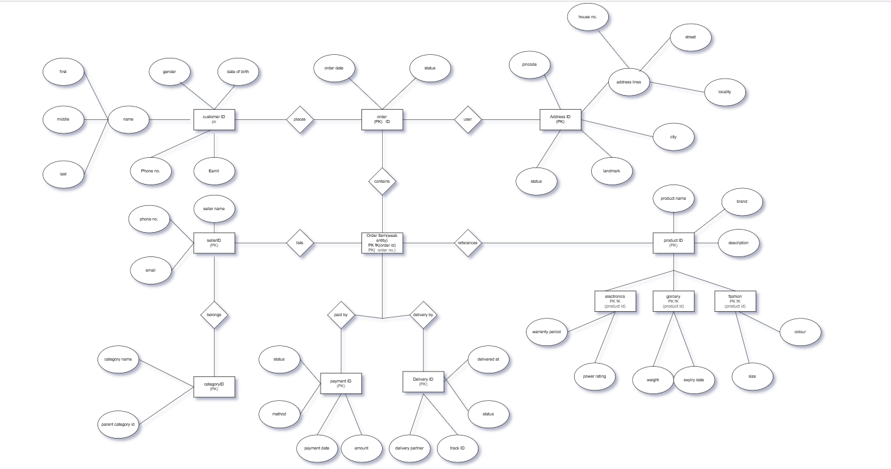

# DBMS ER Diagram — Experiment 1

## Aim

Design an **Entity-Relationship (ER) Diagram** for an **Indian E-Commerce Platform** with the entities **Customer, Product, Order, OrderItem, Seller, Category, Payment, Delivery, and Address**.

## Objective

The objective of this experiment is to represent the structure of an e-commerce database using an ER diagram and identify the entities, attributes, relationships, keys, and constraints involved in the system.

### ER Diagram

## Entities

The ER diagram consists of the following entities:

* **Customer** — Stores customer information.
* **Product** — Stores product details.
* **Order** — Represents orders placed by customers.
* **OrderItem** — Represents individual products within an order.
* **Seller** — Stores seller information.
* **Category** — Classifies products into different categories.
* **Payment** — Stores payment-related information.
* **Delivery** — Stores delivery and tracking information.
* **Address** — Stores customer delivery addresses.

## Concepts Implemented

The ER diagram demonstrates the following DBMS concepts:

* **Primary Key (PK)** — Uniquely identifies each entity.
* **Foreign Key (FK)** — Establishes a connection between related entities.
* **Composite Key** — `OrderID + ProductID` in `OrderItem`.
* **Multi-Valued Attributes** — Attributes such as customer phone/email and product images.
* **Weak Entity** — `OrderItem` depends on `Order` for its identification.
* **Specialization** — `Product` is specialized into:

  * Physical Product
  * Digital Product
* **Cardinality** — Represents relationships such as `1:1`, `1:N`, and `N:1`.
* **Participation Constraints** — Shows whether entity participation in a relationship is mandatory or optional.
* **Derived Attributes** — Values such as order total can be derived from related data.

## Relationships

Some major relationships represented in the diagram are:

| Relationship       | Cardinality |
| ------------------ | ----------- |
| Customer → Order   | 1 : N       |
| Order → Payment    | 1 : 1       |
| Order → OrderItem  | 1 : N       |
| Seller → Product   | 1 : N       |
| Product → Category | N : 1       |
| Order → Delivery   | 1 : 1       |
| Customer → Address | 1 : N       |

## ER Diagram

The complete ER diagram is available in:

**`Indian_Ecommerce_ER_Diagram.drawio`**

It can be opened and edited using **Draw.io / diagrams.net**.

## Conclusion

The ER diagram successfully represents the database structure of an Indian e-commerce platform. It identifies the major entities, attributes, relationships, keys, specialization, weak entity, multi-valued attributes, cardinality, and participation constraints required for designing the database.
