# DBMS Practical – Experiment 3

## Employee–Department–Project Database

---

## 1. Aim

To create an Employee–Department–Project database schema. Insert at least 30 employees across 5 departments and 8 projects. Write SQL queries demonstrating selection, projection, aggregates, GROUP BY, HAVING, CASE expressions, and ORDER BY.

---

## 2. Database Schema

The following tables were created:

### Department

| Column | Description |
|---|---|
| `dept_id` | Department ID |
| `dept_name` | Department Name |
| `location` | Department Location |

### Employee

| Column | Description |
|---|---|
| `emp_id` | Employee ID |
| `emp_name` | Employee Name |
| `job_title` | Job Title |
| `salary` | Employee Salary |
| `hire_date` | Hiring Date |
| `dept_id` | Department ID |

### Project

| Column | Description |
|---|---|
| `project_id` | Project ID |
| `project_name` | Project Name |
| `budget` | Project Budget |
| `start_date` | Project Start Date |
| `dept_id` | Department ID |

### Employee_Project

| Column | Description |
|---|---|
| `emp_id` | Employee ID |
| `project_id` | Project ID |
| `hours_worked` | Hours Worked |

---

## 3. Data Inserted

### Departments

A total of 5 departments were inserted:

Engineering  
Human Resources  
Finance  
Marketing  
Operations

### Employees

A total of 30 employees were inserted.

### Projects

A total of 8 projects were inserted.

### Employee-Project Assignments

Employees were assigned to different projects using the employee_project table.

## 4. SQL Concepts Demonstrated

The following SQL concepts are implemented in this experiment:

- Selection
- Projection
- Selection + Projection
- Aggregate Functions
- GROUP BY
- HAVING
- CASE Expressions
- ORDER BY
- GROUP BY + HAVING + ORDER BY
- Project-wise aggregation
- JOIN operations

## 5. Selection

### Description

Selection is used to retrieve rows that satisfy a specified condition.

### Query

```sql
SELECT *
FROM employee
WHERE salary > 70000;
```

### Purpose

This query displays employees whose salary is greater than 70,000.

### Output

Paste the ByteXL output screenshot here.

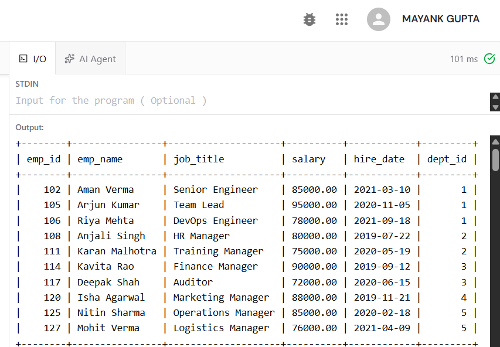

**Output Screenshot – Selection**

## 6. Projection

### Description

Projection is used to retrieve specific columns from a table.

### Query

```sql
SELECT emp_name, job_title
FROM employee;
```

### Purpose

This query displays only the employee name and job title.

### Output

Paste the ByteXL output screenshot here.

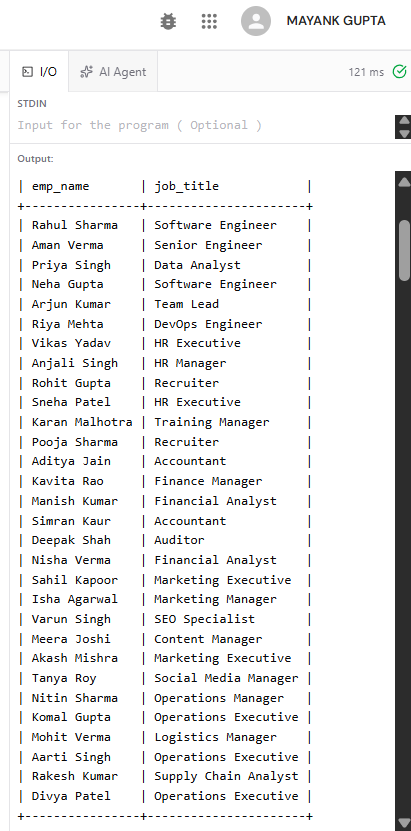

**Output Screenshot – Projection**

## 7. Selection and Projection

### Query

```sql
SELECT emp_name, salary
FROM employee
WHERE salary > 75000;
```

### Purpose

This query displays the names and salaries of employees whose salary is greater than 75,000.

### Output

Paste the ByteXL output screenshot here.

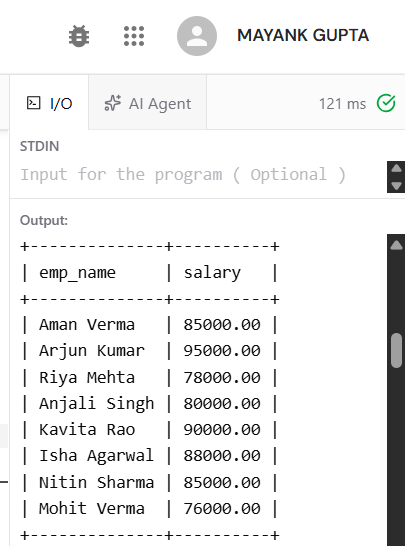

**Output Screenshot – Selection and Projection**

## 8. Aggregate Function – COUNT

### Query

```sql
SELECT COUNT(*) AS total_employees
FROM employee;
```

### Purpose

This query counts the total number of employees.

### Expected Result

The total number of employees is 30.

### Output

Paste the ByteXL output screenshot here.

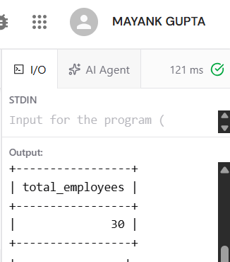

**Output Screenshot – COUNT**

## 9. Aggregate Function – AVG

### Query

```sql
SELECT ROUND(AVG(salary), 2) AS average_salary
FROM employee;
```

### Purpose

This query calculates the average salary of all employees.

### Output

Paste the ByteXL output screenshot here.

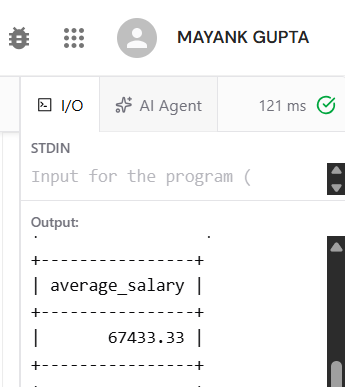

**Output Screenshot – AVG**

## 10. Aggregate Function – MAX

### Query

```sql
SELECT MAX(salary) AS highest_salary
FROM employee;
```

### Purpose

This query finds the highest salary among all employees.

### Output

Paste the ByteXL output screenshot here.

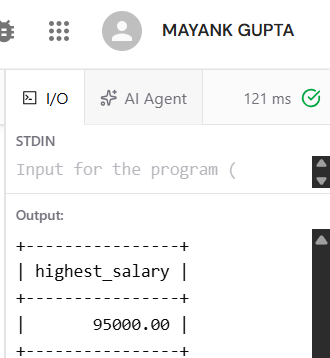

**Output Screenshot – MAX**

## 11. Aggregate Function – MIN

### Query

```sql
SELECT MIN(salary) AS lowest_salary
FROM employee;
```

### Purpose

This query finds the lowest salary among all employees.

### Output

Paste the ByteXL output screenshot here.

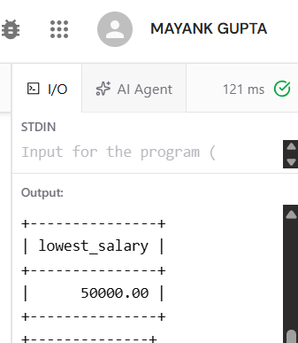

**Output Screenshot – MIN**

## 12. Aggregate Function – SUM

### Query

```sql
SELECT SUM(salary) AS total_salary
FROM employee;
```

### Purpose

This query calculates the total salary paid to all employees.

### Output

Paste the ByteXL output screenshot here.

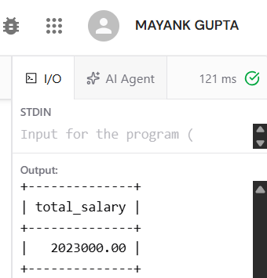

**Output Screenshot – SUM**

## 13. GROUP BY

### Query

```sql
SELECT dept_id, COUNT(*) AS employee_count
FROM employee
GROUP BY dept_id;
```

### Purpose

This query groups employees according to their department and counts the employees in each department.

### Output

Paste the ByteXL output screenshot here.

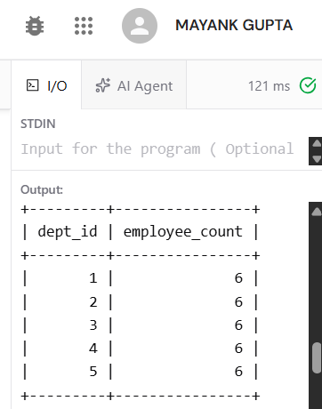

**Output Screenshot – GROUP BY**

## 14. GROUP BY with Department Name

### Query

```sql
SELECT
    d.dept_name,
    COUNT(e.emp_id) AS employee_count
FROM department d
JOIN employee e
ON d.dept_id = e.dept_id
GROUP BY d.dept_id, d.dept_name;
```

### Purpose

This query displays each department along with its number of employees.

### Output

Paste the ByteXL output screenshot here.

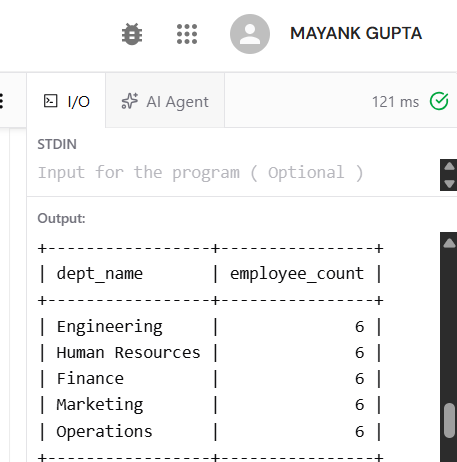

**Output Screenshot – Department-wise GROUP BY**

## 15. GROUP BY with AVG

### Query

```sql
SELECT
    d.dept_name,
    ROUND(AVG(e.salary), 2) AS average_salary
FROM department d
JOIN employee e
ON d.dept_id = e.dept_id
GROUP BY d.dept_id, d.dept_name;
```

### Purpose

This query calculates the average salary for each department.

### Output

Paste the ByteXL output screenshot here.

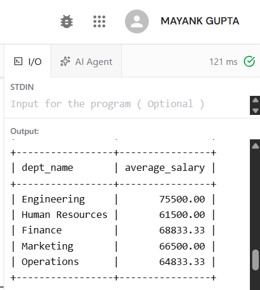

**Output Screenshot – Department Average Salary**

## 16. HAVING

### Query

```sql
SELECT
    dept_id,
    COUNT(*) AS employee_count
FROM employee
GROUP BY dept_id
HAVING COUNT(*) > 5;
```

### Purpose

The HAVING clause filters groups after GROUP BY.
This query displays departments having more than 5 employees.

### Output

Paste the ByteXL output screenshot here.

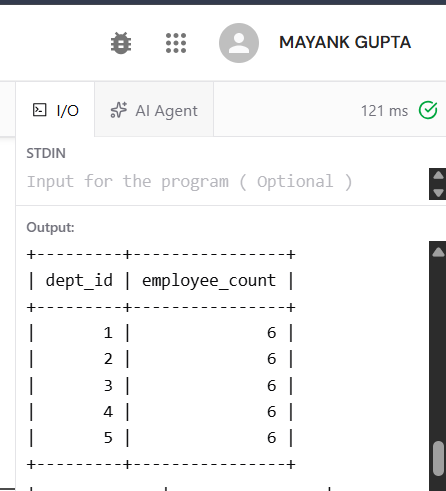

**Output Screenshot – HAVING**

## 17. HAVING with AVG

### Query

```sql
SELECT
    d.dept_name,
    ROUND(AVG(e.salary), 2) AS average_salary
FROM department d
JOIN employee e
ON d.dept_id = e.dept_id
GROUP BY d.dept_id, d.dept_name
HAVING AVG(e.salary) > 65000;
```

### Purpose

This query displays departments whose average salary is greater than 65,000.

### Output

Paste the ByteXL output screenshot here.

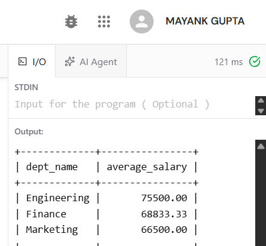

**Output Screenshot – HAVING with AVG**

## 18. CASE Expression – Salary Category

### Query

```sql
SELECT
    emp_name,
    salary,
    CASE
        WHEN salary >= 80000 THEN 'High Salary'
        WHEN salary >= 60000 THEN 'Medium Salary'
        ELSE 'Low Salary'
    END AS salary_category
FROM employee;
```

### Purpose

The CASE expression classifies employees into High, Medium, and Low salary categories.

### Output

Paste the ByteXL output screenshot here.

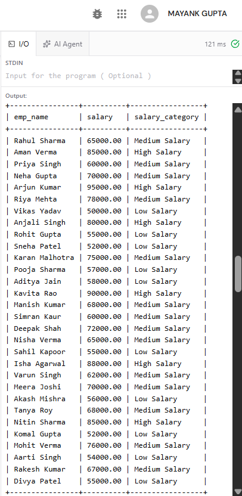

**Output Screenshot – CASE Expression**

## 19. CASE Expression – Department

### Query

```sql
SELECT
    emp_name,
    CASE
        WHEN dept_id = 1 THEN 'Engineering'
        WHEN dept_id = 2 THEN 'Human Resources'
        WHEN dept_id = 3 THEN 'Finance'
        WHEN dept_id = 4 THEN 'Marketing'
        WHEN dept_id = 5 THEN 'Operations'
        ELSE 'Unknown'
    END AS department
FROM employee;
```

### Purpose

This query uses CASE to display the department name based on the department ID.

### Output

Paste the ByteXL output screenshot here.

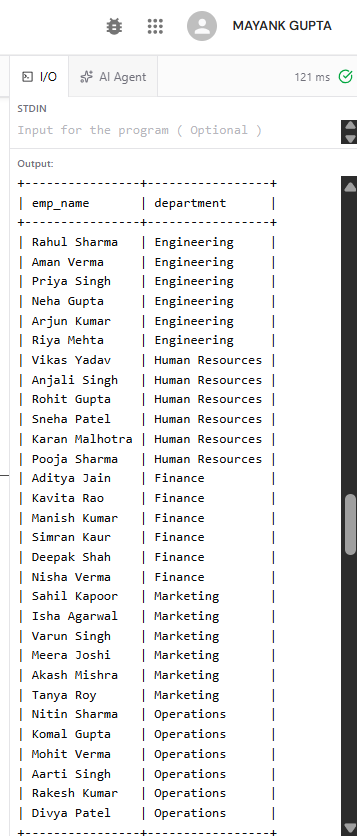

**Output Screenshot – Department CASE**

## 20. ORDER BY – Ascending

### Query

```sql
SELECT emp_name, salary
FROM employee
ORDER BY salary ASC;
```

### Purpose

This query displays employees in ascending order of salary.

### Output

Paste the ByteXL output screenshot here.

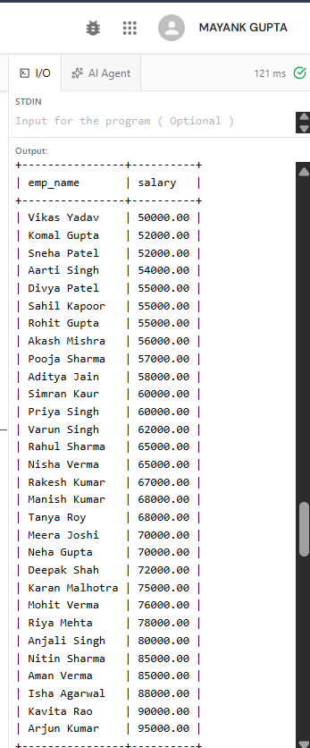

**Output Screenshot – ORDER BY ASC**

## 21. ORDER BY – Descending

### Query

```sql
SELECT emp_name, salary
FROM employee
ORDER BY salary DESC;
```

### Purpose

This query displays employees in descending order of salary.

### Output

Paste the ByteXL output screenshot here.

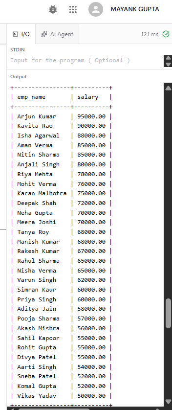

**Output Screenshot – ORDER BY DESC**

## 22. GROUP BY + HAVING + ORDER BY

### Query

```sql
SELECT
    d.dept_name,
    COUNT(e.emp_id) AS employee_count
FROM department d
JOIN employee e
ON d.dept_id = e.dept_id
GROUP BY d.dept_id, d.dept_name
HAVING COUNT(e.emp_id) > 5
ORDER BY employee_count DESC;
```

### Purpose

This query:

- Groups employees by department.
- Filters departments using HAVING.
- Sorts the result using ORDER BY.

### Output

Paste the ByteXL output screenshot here.

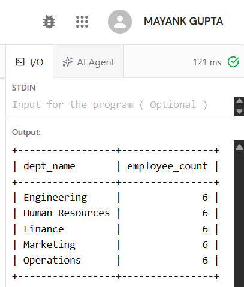

**Output Screenshot – GROUP BY + HAVING + ORDER BY**

## 23. Project-wise Employee Count

### Query

```sql
SELECT
    p.project_name,
    COUNT(ep.emp_id) AS employee_count
FROM project p
JOIN employee_project ep
ON p.project_id = ep.project_id
GROUP BY p.project_id, p.project_name
ORDER BY employee_count DESC;
```

### Purpose

This query displays the number of employees working on each project.

### Output

Paste the ByteXL output screenshot here.

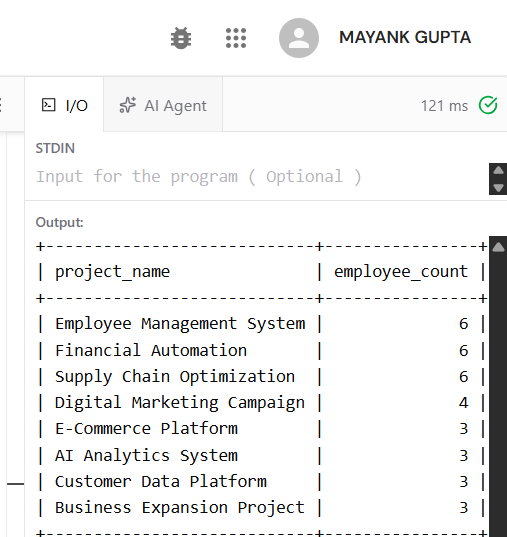

**Output Screenshot – Project-wise Employee Count**

## 24. Employee–Department–Project Details

### Query

```sql
SELECT
    e.emp_name,
    d.dept_name,
    p.project_name,
    ep.hours_worked
FROM employee e
JOIN department d
ON e.dept_id = d.dept_id
JOIN employee_project ep
ON e.emp_id = ep.emp_id
JOIN project p
ON ep.project_id = p.project_id
ORDER BY e.emp_name ASC;
```

### Purpose

This query combines the Employee, Department, and Project tables to display complete employee project information.

### Output

Paste the ByteXL output screenshot here.

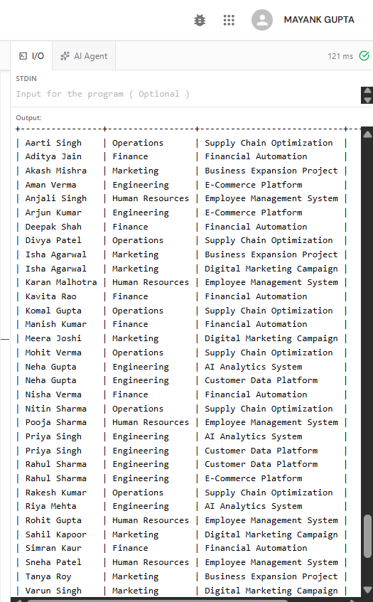

**Output Screenshot – Employee Department Project**

## 25. Verification

### Verify Number of Departments

### Query

```sql
SELECT COUNT(*) AS total_departments
FROM department;
```

### Expected result:

```text
5
```

### Verify Number of Employees

### Query

```sql
SELECT COUNT(*) AS total_employees
FROM employee;
```

### Expected result:

```text
30
```

### Verify Number of Projects

### Query

```sql
SELECT COUNT(*) AS total_projects
FROM project;
```

### Expected result:

```text
8
```

### Output

Paste the ByteXL verification output screenshot here.

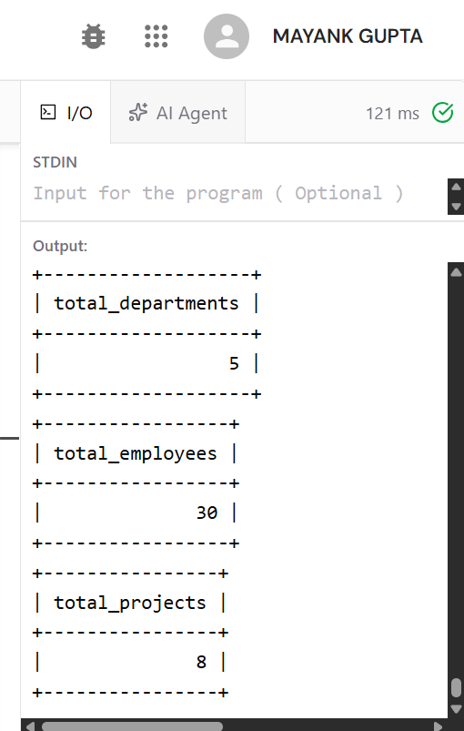

**Output Screenshot – Verification**

## 26. Result

The Employee–Department–Project database schema was successfully created.
A total of 30 employees, 5 departments, and 8 projects were inserted successfully.
SQL queries demonstrating Selection, Projection, Aggregate Functions, GROUP BY, HAVING, CASE Expressions, ORDER BY, and JOIN operations were successfully executed.

## 27. Conclusion

This experiment provided practical knowledge of relational database design and SQL query operations. The relationships between employees, departments, and projects were implemented using primary keys and foreign keys. Various SQL operations were performed to retrieve, group, filter, classify, aggregate, and sort the database records.
